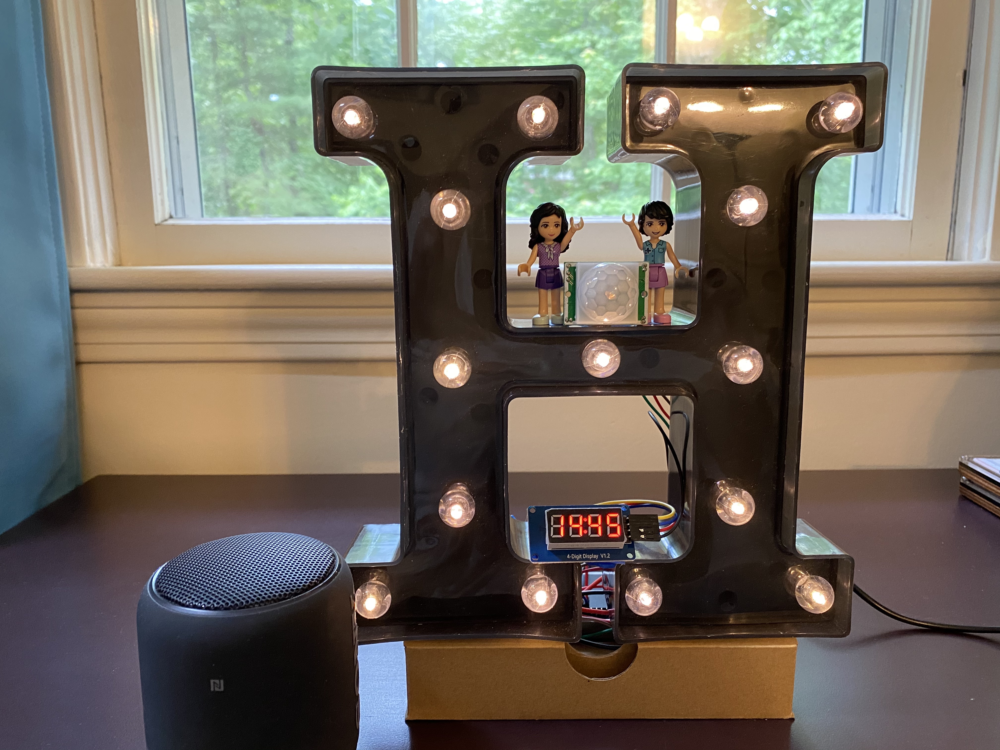

## Crafting and Programming Raspberry Pi Gadgets with Python

I started using Raspberry Pi in December 2020. I have been using Python to make Raspi apps. See:

- [Playground folder](playground/): for the code I used to do basic things, learn about something new about Python programming or try out new sensors/parts.
- [Projects folder](projects/): for my projects.

  
  
   
  
  

