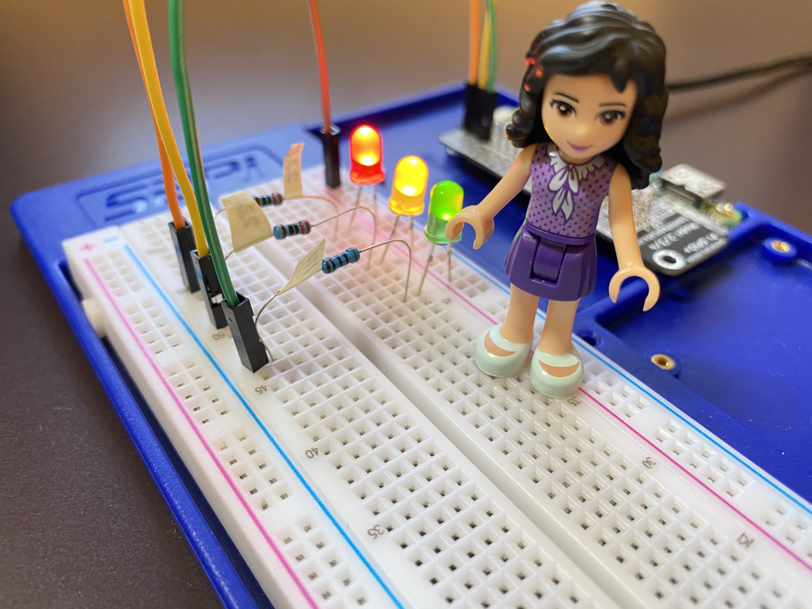
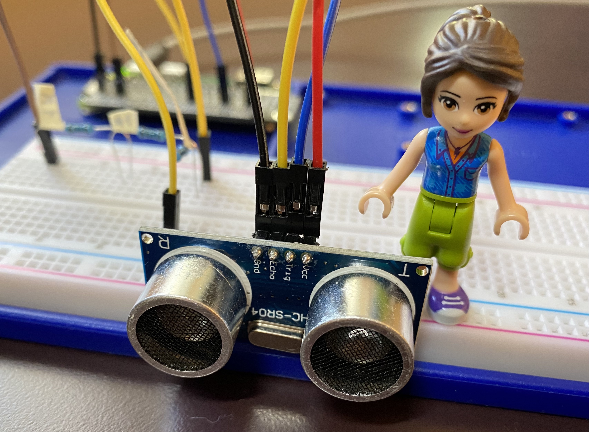

## Crafting and Programming Raspberry Pi Gadgets with Python

I started using Raspberry Pi in December 2020. I have been using Python to make Raspi apps. See:

- [Playground folder](playground/): for the code I used to do basic things, learn about something new about Python programming or try out new sensors/parts.
- [Projects folder](projects/): for my preliminary or on-going projects.
- Completed/published projects:
  - In-piano Humidity Sensor (2021/04)
  - [Itsy Bitsy Programmable Clock](https://github.com/HSSBoston/itsy-bitsy-prog-clock/) (2021/06)
  - Covid-19 PVI (Pandemic Vulnerability Index) Tracker (2022/03)
  - [Ned: The Hydration Reminder](https://github.com/HSSBoston/ned) (2022/07)
  - [Smart Earring: Sound-sensitive and Siri-ready LEDs for Earrings](https://github.com/HSSBoston/smart-earring) (2023/03)

  
  

