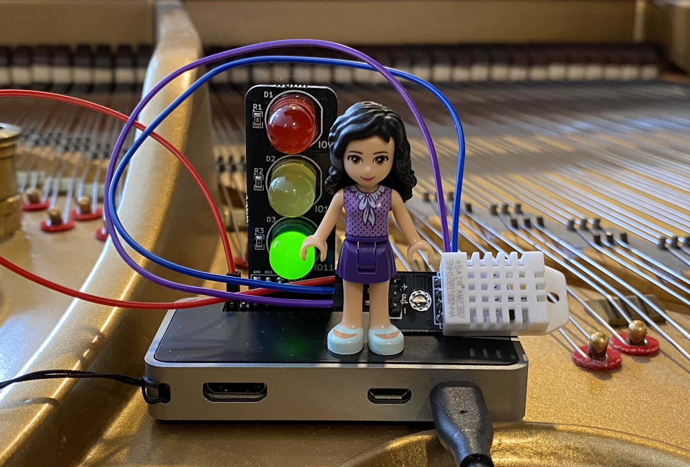

# Crafting and Programming Raspberry Pi with Python

I started using Raspberry Pi in December 2020. Since then, I have been using Python to make Raspi apps. See: 

- [Playground folder](playground/): for the code I used to do basic things, learn about something new about Python programming or try out new sensors/parts. 
- [Projects folder](projects/): for my weekend and term projects.

  

