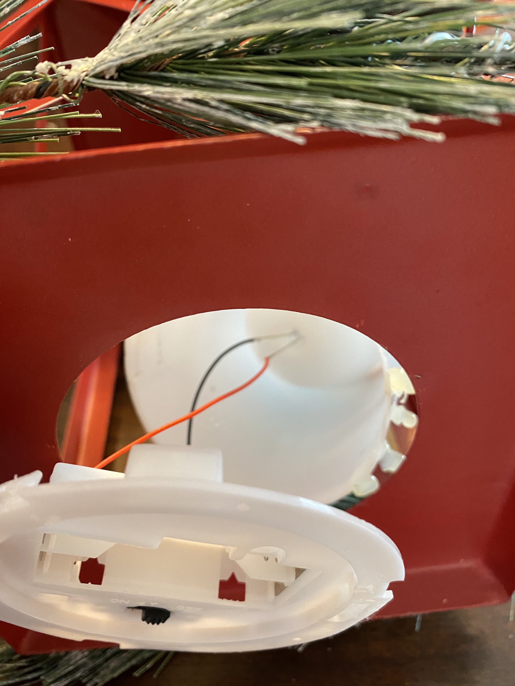
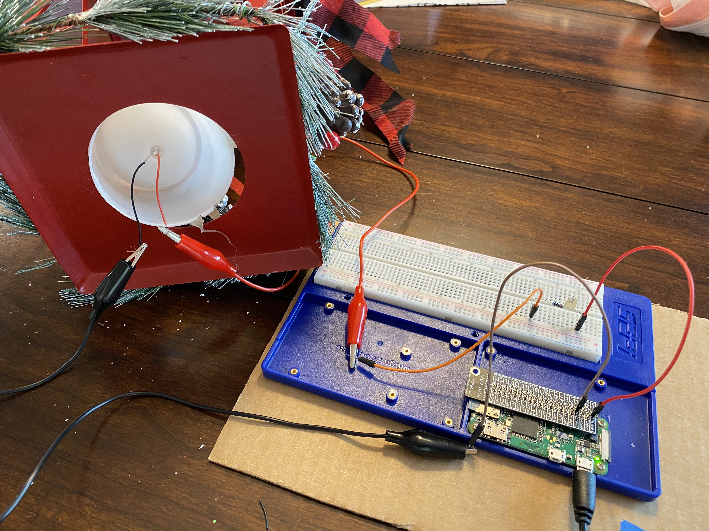

## Hacking a LED candle and a LED string

Bought a battery-operated LED candle at a local supermarket. 

Took out the battery pack. 

Connected the LED candle light with Raspi and switched it on with a Python program (candle.py).

Revised the Python program to use Blue Dot.

Bought a LED string and took out its battery pack. 

Connected the LED string's wires with Raspi adn switched it on and off with a Python program and Blue Dot. 

candle-bluedot.py
